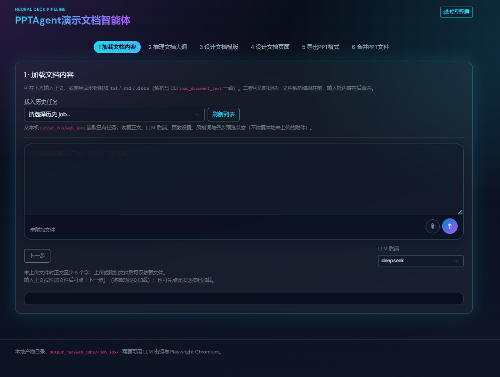
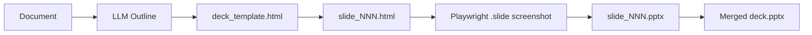

# aippt

**Turn documents into presentation decks — powered by LLM, HTML slides, and Playwright raster export.**

将 Word / 文本 / Markdown 文档经大模型生成 **HTML 幻灯片**，再对 **`.slide`** 区域截图并导出为 **PPTX**。提供 **CLI 一条龙** 与可选 **Web 六步向导**。



[](https://www.python.org/)
[](https://github.com/langchain-ai/langchain)
[](https://playwright.dev/python/)
[-informational)](https://flask.palletsprojects.com/)
[](LICENSE)

---

## Table of contents

- [Features](#features)
- [How it works](#how-it-works)
- [Prerequisites](#prerequisites)
- [Installation](#installation)
- [Configuration](#configuration)
- [Usage](#usage)
  - [Command line](#command-line)
  - [Web wizard](#web-wizard-optional)
- [Project structure](#project-structure)
- [Documentation](#documentation)
- [Development](#development)
- [License](#license)

---

## Features

- **Document in** — `.txt`, `.md`, `.docx`（`python-docx` 抽取）
- **LLM outline** — 结构化 `deck_outline.json`（页标题、概要、要点）
- **HTML deck** — 统一样式模板 `deck_template.html` + 逐页 HTML（封面 / 目录 / 正文）
- **Raster export** — Playwright 仅截取 **`.slide`** 元素（非整页视口），嵌入单页 `.pptx`
- **Merge** — 按大纲顺序合并为带时间戳的演示文稿
- **Dual entry** — `python -m aippt` CLI 与 `apps/web` 向导共用 `aippt.services` 编排
- **Pluggable LLM** — [Ollama](https://ollama.com) 或 [DeepSeek](https://platform.deepseek.com)（LangChain 1.3+ LCEL）

> 导出结果为**栅格图幻灯片**，PPT 内文字不可直接编辑（与截图导出模型一致）。

---

## How it works



| Step | Output |
|------|--------|
| 1 | 读取文档正文 |
| 2 | `deck_outline.json` |
| 3 | `deck_template.html` |
| 4 | `slide_000.html` …（封面 / 目录 / 正文） |
| 5 | `slide_NNN.pptx`（每页截图） |
| 6 | `<name>_YYYYMMDD_HHMMSS.pptx` |

---

## Prerequisites

| Requirement | Notes |
|-------------|--------|
| **Python 3.10+** | 推荐虚拟环境 |
| **Chromium** | `python -m playwright install chromium` |
| **LLM API** | Ollama 云端密钥和/或 DeepSeek API Key |
| **Git** | 克隆本仓库 |

---

## Installation

```bash
git clone https://github.com/yeyuandi/aippt.git
cd aippt

python -m venv .venv
# Windows
.venv\Scripts\activate
# Linux / macOS
source .venv/bin/activate

pip install -r requirements.txt
python -m playwright install chromium
```

复制环境变量模板（**勿将 `.env` 提交到 Git**）：

```bash
cp .env.example .env   # Windows: copy .env.example .env
# 编辑 .env，填入 API Key 与模型名
```

---

## Configuration

与 [`.env.example`](.env.example) 对齐。常用变量：

| Variable | Description |
|----------|-------------|
| `LLM_PROVIDER` | `ollama`（默认）或 `deepseek` |
| `LLM_TEMPERATURE` | 采样温度，默认 `0.3` |
| `OLLAMA_API_KEY` | 使用 `ollama.com` 云端时必填 |
| `OLLAMA_BASE_URL` | 默认 `https://ollama.com`；本机可为 `http://127.0.0.1:11434` |
| `OLLAMA_MODEL` | 如 `gpt-oss:120b` |
| `DEEPSEEK_API_KEY` | `LLM_PROVIDER=deepseek` 时必填 |
| `DEEPSEEK_MODEL` | 默认 `deepseek-chat` |
| `FLASK_SECRET_KEY` | Web 生产环境必填 |
| `FLASK_MAX_UPLOAD_MB` | 上传大小上限（MB），默认 `32` |

完整说明、导出参数与故障排查见 **[aippt/README.md](aippt/README.md)**。

---

## Usage

### Command line

最小示例（使用 [`samples/sample_input.txt`](samples/sample_input.txt)）：

```bash
python -m aippt --input samples/sample_input.txt --work-dir output_run
```

更多示例：

```bash
# Word 文档 + 页数控制
python -m aippt --input ./report.docx --work-dir output_run --max-slides 25 --target-slides 22

# 使用 DeepSeek
python -m aippt --llm-provider deepseek --input samples/sample_input.txt

# 带进度输出的示例脚本
python -m aippt.example_invoke --html-style "浅色商务，主色点缀"
```

默认产出目录：`output_run/<文档主文件名>/`（含 `deck_outline.json`、`slide_NNN.html`、合并后的 pptx）。

**其他 CLI 入口**（重渲染、单页转换等）见 [aippt/README.md — 命令速查](aippt/README.md#命令速查)。

### Web wizard (optional)

```bash
pip install -r requirements.txt
python -m flask --app apps.web.app:create_app run --debug
```

浏览器访问 **http://127.0.0.1:5000/**，按向导完成：

**上传 → 大纲 → 模板 HTML → 逐页 HTML → 导出 PPTX → 下载**

- 任务数据：`output_run/web_jobs/<job_id>/`
- 生产部署请设置 `FLASK_SECRET_KEY`，勿使用 `--debug`

---

## Project structure

```
.
├── aippt/                 # Core library (LangChain, export, services)
│   ├── cli/               # python -m aippt | aippt.example_invoke
│   ├── chains/            # LCEL: outline, slide HTML
│   ├── services/          # Orchestration (CLI + Web)
│   ├── export/            # html_to_ppt, merge, rerender
│   ├── domain/            # Pydantic models
│   ├── llm/               # build_chat_llm(provider=…)
│   ├── prompts/           # Prompt templates
│   ├── io/                # Document loading
│   └── settings/          # .env read/write
├── apps/
│   └── web/               # Flask app (templates, static, API)
├── docs/                  # html_to_ppt.md, faq.md
├── samples/               # Sample inputs
├── tests/unit/            # Unit tests (no live LLM)
└── requirements.txt
```

**分层原则**：`aippt` 不依赖 Flask；`apps/web` 只调用 `aippt.services`，便于单独测试与复用核心库。

---

## Documentation

| Document | Content |
|----------|---------|
| [aippt/README.md](aippt/README.md) | 流水线详解、CLI 速查、环境变量、编程 import |
| [docs/html_to_ppt.md](docs/html_to_ppt.md) | HTML→PPTX 原理、`HtmlToPptConfig`、CLI 与编程 API |
| [docs/faq.md](docs/faq.md) | 安装、LLM、排版裁切、Web 任务 FAQ |
| [.env.example](.env.example) | 环境变量模板 |

---

## Development

```bash
# 单元测试（不调用真实 LLM）
python -m unittest discover -s tests/unit

# 或安装 pytest 后
pip install pytest
pytest tests/unit
```

贡献代码前请确保：

1. 不提交 `.env`、`output_run/` 等敏感或生成物（见 [.gitignore](.gitignore)）
2. 变更 `aippt/` 流水线时同步更新 `aippt/README.md` 与本 README

---

## License

本项目采用 **[MIT License](LICENSE)**（Copyright © 2026 aippt contributors）。

---

## Acknowledgments

- [LangChain](https://github.com/langchain-ai/langchain) — LLM orchestration
- [Playwright](https://playwright.dev/) — headless browser rasterization
- [python-pptx](https://github.com/scanny/python-pptx) — PPTX merge
